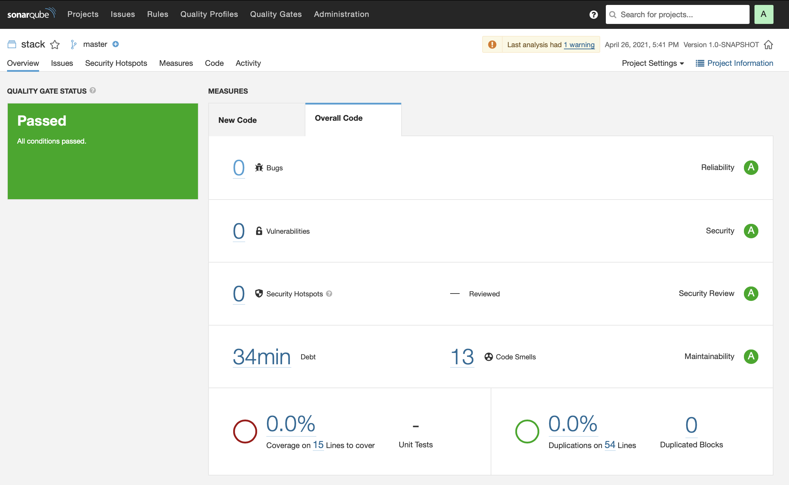
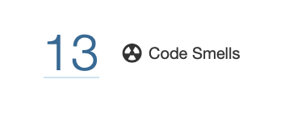
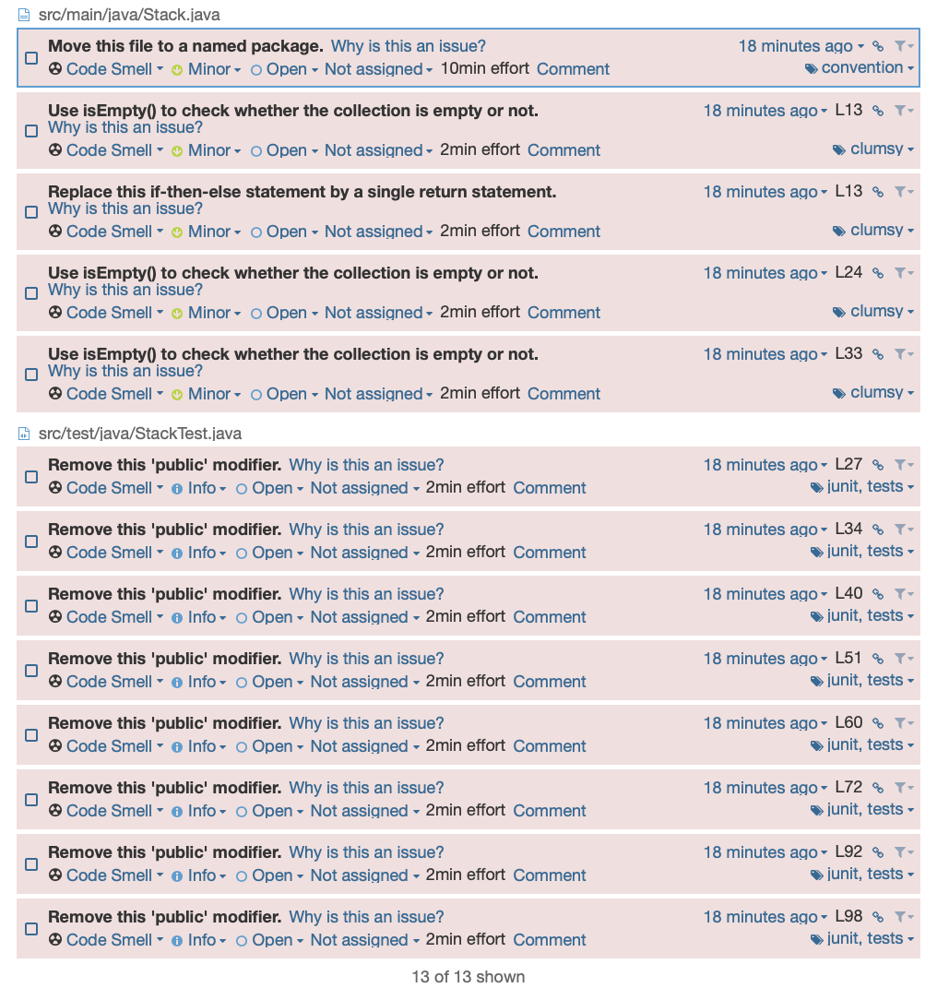
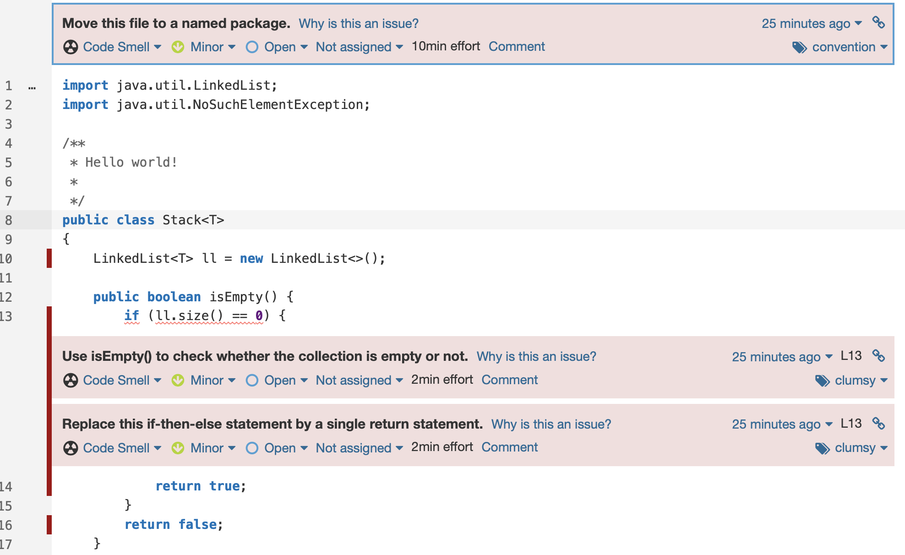
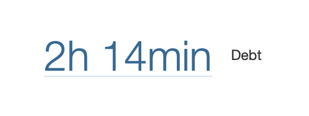
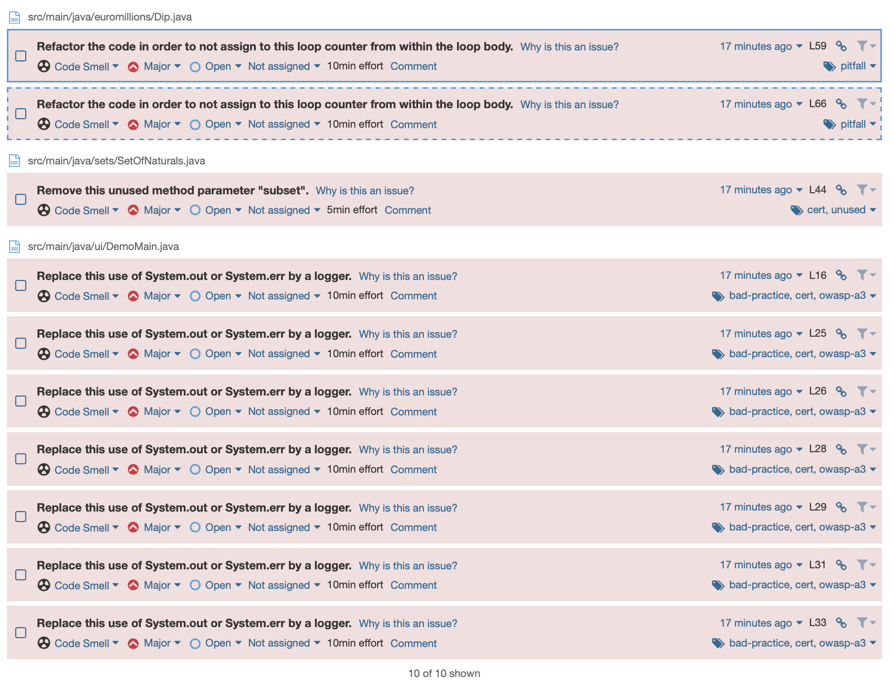

# Lab6 | Static code analysis with SonarQube

# Exercise 1

Exercises 1 a) -> d) are setup exercises which I completed by folowing the lab guide! There is no need to comment on these.

## 1-e)

##### Access the SonarQube dashboard. Has your project passed the defined quality gate? Elaborate your answer

The project has passed the defined quality gate as shown on the screenshot. I used the lab1 - ex1 maven project to test this.



Altough the quality gate status is "Passed" we can further inspect the code and analyze the 13 code smells that I had on that project.




Altough in this project I didn't have other negative aspects (like Vulnerabilities, Bugs, Security Hotspots, etc...), this comes in handy because it allows me to point out problems that are usually missed by "the naked eye".

## 1-f)

##### Explore the analysis results and complete with a few sample issues, as applicable. (Place your response in a Readme document/markdown file, along with the code project).

As stated previously, the only problems this basic project had is code smells, so that's what I'll be exploring now.

Code Smell - "In computer programming, a code smell is any characteristic in the source code of a program that possibly indicates a deeper problem.[1][2] Determining what is and is not a code smell is subjective, and varies by language, developer, and development methodology." [Source -> Wikipedia "Code Smells"](https://en.wikipedia.org/wiki/Code_smell)

In the "Issues" tab this is the first problems that SonarQube shows me are:

- Move this file to a named package
- Use isEmpty() to check whether the collection is empty or not.
- Replace this if-then-else statement by a single return statement



| Issue      | Problem description                                               | How to solve                                                                                                                                                                                                                                                                 |
| ---------- | ----------------------------------------------------------------- | ---------------------------------------------------------------------------------------------------------------------------------------------------------------------------------------------------------------------------------------------------------------------------- |
| Code Smell | Move this file to a named package.                                | "Unnamed packages are provided by the Java platform principally for convenience when developing small or temporary applications or when just beginning development."                                                                                                         |
| Code Smell | Use isEmpty() to check whether the collection is empty or not.    | "Using Collection.size() to test for emptiness works, but using Collection.isEmpty() makes the code more readable and can be more performant. The time complexity of any isEmpty() method implementation should be O(1) whereas some implementations of size() can be O(n)." |
| Code Smell | Replace this if-then-else statement by a single return statement. | "Return of boolean literal statements wrapped into if-then-else ones should be simplified. Similarly, method invocations wrapped into if-then-else differing only from boolean literals should be simplified into a single invocation."                                      |

# Exercise 2

## 2-a)

##### Take note of the technical debt found. Explain what this value means.



Technical Debt - "Technical debt (also known as design debt[1] or code debt, but can be also related to other technical endeavors) is a concept in software development that reflects the implied cost of additional rework caused by choosing an easy (limited) solution now instead of using a better approach that would take longer.[2]" [Source -> Wikipedia "Technical Debt"](https://en.wikipedia.org/wiki/Technical_debt)

In other words, it means that if you are lazy and implement code in a lazy way you'll have to refactor the code later to a better implementation. Technical debt is the sum of time you'll waste by not implementing code the right way on the first time.

## 2-a)

##### Analyze the reported problems and be sure to correct the severe code smells reported (critical and major).

I have 0 critical code smells and 10 major code smells. I'm going to fix them. The code will be available under the "ex2/" directory.

Major code smells:


##### 1. Refactor..

##### 2. Refactor..

##### 3. Remove this unused method parameter "subset".

Before:

```
public boolean intersects(SetOfNaturals subset) {
    return false;
}
```

After:

```
public boolean intersects() {
    return false;
}
```

##### 4,5,6,7,8,9,10. Replace this use of System.out or System.err by a logger.

Before:

```
package ui;

import euromillions.CuponEuromillions;
import euromillions.Dip;
import euromillions.EuromillionsDraw;

public class DemoMain {

    /**
     * demonstrates a client for ramdom euromillions bets
     */
    public static void main(String[] args) {

        // played sheet
        CuponEuromillions thisWeek = new CuponEuromillions();
        System.out.println("Betting with three random bets...");
        thisWeek.addDipToCuppon(Dip.generateRandomDip());
        thisWeek.addDipToCuppon(Dip.generateRandomDip());
        thisWeek.addDipToCuppon(Dip.generateRandomDip());

        // simulate a random draw
        EuromillionsDraw draw = EuromillionsDraw.generateRandomDraw();

        //report results
        System.out.println("You played:");
        System.out.println(thisWeek.format());

        System.out.println("Draw results:");
        System.out.println(draw.getDrawResults().format());

        System.out.println("Your score:");
        for (Dip dip : draw.findMatches(thisWeek)) {
            System.out.println(dip.format());

        }
    }
}

```

After:

```
public static void main(String[] args) {
    Logger logger = Logger.getLogger(DemoMain.class.getName());

    // played sheet
    CuponEuromillions thisWeek = new CuponEuromillions();
    logger.log(Level.INFO, "Betting with three random bets...");
    thisWeek.addDipToCuppon(Dip.generateRandomDip());
    thisWeek.addDipToCuppon(Dip.generateRandomDip());
    thisWeek.addDipToCuppon(Dip.generateRandomDip());


    // simulate a random draw
    EuromillionsDraw draw = EuromillionsDraw.generateRandomDraw();

    //report results
    logger.log(Level.INFO, "You played:");
    logger.log(Level.INFO, thisWeek.format());

    logger.log(Level.INFO, "Draw results:");
    logger.log(Level.INFO, draw.getDrawResults().format());

    logger.log(Level.INFO, "Your score:");
    for (Dip dip : draw.findMatches(thisWeek)) {
        logger.log(Level.INFO, dip.format());

    }
}
```

## 2-c)

##### Code coverage reports require an additional plugin. Be sure to use a project with unit tests and configured code coverage (e.g.: add the jacoco plugin to maven). You may have already did it in Lab 2.
